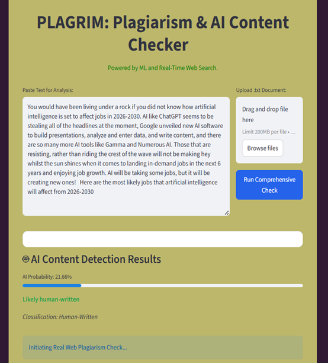
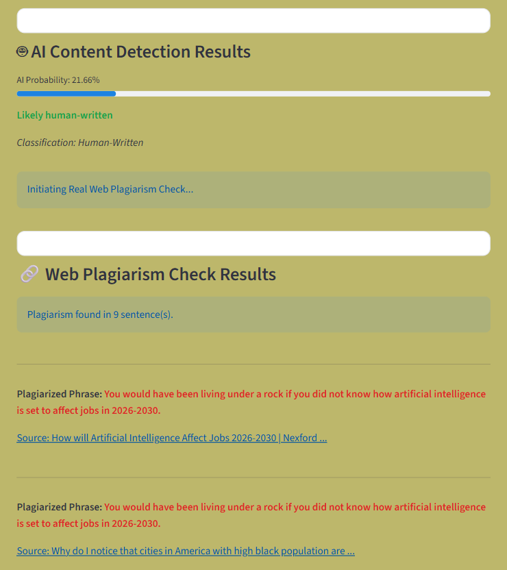
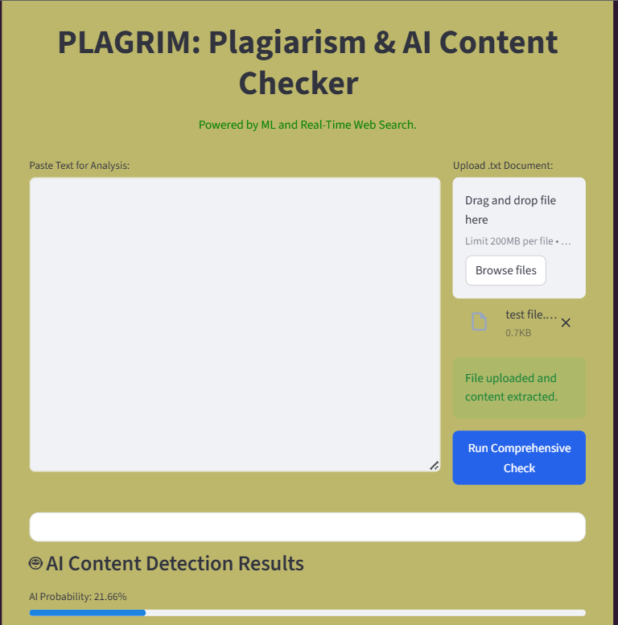

# PLAGRIM
A Dual-Engine Content Checker deployed via Streamlit that verifies authenticity using a trained ML model for AI detection and a Search Grounding method for identifying live web plagiarism sources.

---

# Key Features

- **AI Content Detection**: Utilizes a trained **Logistic Regression model** (serialized via `joblib`) to predict the probability of text being generated by an LLM, distinguishing between human and machine authorship.
- **Real-Time Plagiarism Checking:** Employs a **Search Grounding** technique that breaks input text into key sentences (shingles) and performs exact-match queries to identify the source URL of verbatim copied content from the live web.
- **Full Integration:** Deployed via a user-friendly **Streamlit application** that loads the trained models (`.pkl` files) and provides a unified report for both analysis types.

---

# Technology Stack

- **Frontend/Deployment:** Streamlit
- **Machine Learning:** Scikit-learn (Logistic Regression, TF-IDF Vectorizer)
- **Data Serialization:** `joblib`
- **Language:** Python
- **Data Source:** Kaggle's "AI vs Human Text" dataset

---

  # Screenshots/Demo

  
